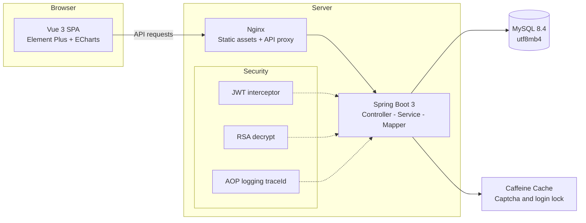

# 绿证交易平台（Green Certificate Trading Platform）

> 基于 Spring Boot 3 + Vue 3 / Element Plus / Vite 的绿色电力证书（绿证）交易系统。
> 前台商城 + 后台管理双端完备，内置拼团、临期促销、长期协议、协同过滤推荐等完整业务闭环，可作为绿证/碳资产类电商交易系统的二次开发模板。

[](./.github/workflows/ci.yml)
[](LICENSE)
[](https://openjdk.org/)
[](https://spring.io/projects/spring-boot)
[](https://vuejs.org/)
[](CONTRIBUTING.md)

**English** | A full-stack green electricity certificate (GEC) trading system built with Spring Boot 3 and Vue 3, featuring a customer-facing marketplace and an admin console with role-based dynamic menus. Ideal as a production-grade template for carbon-asset / renewable-energy-certificate e-commerce platforms.

---

## ✨ 功能特性

### 前台商城

| 模块 | 说明 |
|---|---|
| 🏠 首页 | 轮播图、公告、分类导航、热门/新品推荐 |
| 📋 商品 | 绿证列表（多条件筛选/排序/分页）、商品详情、搜索 |
| 🛒 交易 | 购物车、下单、支付状态流转、退款申请 |
| ❤️ 收藏与评价 | 评分 1-5 星，评价审核机制 |
| 🤝 绿证拼团 | 多人拼团成团享优惠，达标自动成团（前后端完整闭环） |
| ⏰ 临期促销 | 折扣绿证专区，按折扣力度排序 |
| 📜 长期购买协议 | 月度/季度/年度协议在线签约申请 |
| 📰 资讯文章 | 绿证知识、政策解读 |
| 🧠 智能推荐 | 基于订单+收藏行为的协同过滤推荐（每日定时更新） |

### 后台管理（按角色动态菜单）

- 数据概览（ECharts 可视化）、商品管理（含折扣/上下架/库存）、分类管理
- 订单管理、物流管理、出入库管理
- 用户管理（多角色）、菜单权限管理、轮播图与公告管理
- 角色体系：`SUPER_ADMIN` / `ADMIN` / `SELLER`（卖方）/ `BUYER`（买方）

### 🔐 安全特性

- **BCrypt 密码散列**（强度 10），数据库不存明文
- **RSA 2048 登录传输加密**：前端经 `GET /api/user/public-key` 获取公钥，密码以 `RSA:` + Base64 密文上送，防中间人嗅探
- **JWT 无状态认证**（HMAC256，2 小时过期），服务端统一密钥经环境变量注入
- **登录防爆破锁定**：同一用户名 15 分钟内失败 5 次 → 锁定 15 分钟
- **AOP 请求日志 + traceId**：全链路日志关联，慢请求（>2s）自动 WARN
- **全局异常处理**：参数校验（`@Validated`）、格式错误统一响应格式

## 🏗️ 系统架构



## 🛠️ 技术栈

| 层级 | 技术 | 选型理由 |
|---|---|---|
| 后端 | Spring Boot 3.4（Java 17+） | LTS 长期支持，原生可观测性 |
| ORM | MyBatis-Plus 3.5 | CRUD 零样板代码，Lambda 条件构造器类型安全 |
| 认证 | java-jwt（HMAC256）+ 拦截器 | 无状态水平扩展；密钥环境变量注入 |
| 缓存 | Caffeine | 进程内高性能缓存，零部署成本，适合单实例起步 |
| 文档 | SpringDoc OpenAPI 2.7 | 自动生成 Swagger UI，前后端并行开发 |
| 前端 | Vue 3.4 + Vite 5 + Element Plus 2.9 | Composition API 生态、秒级冷启动 |
| 状态 | Vue Router 4 + Vuex 4 | 官方推荐组合 |
| 数据库 | MySQL 8.4（utf8mb4） | 完整 Unicode 支持 |
| 部署 | Docker Compose + GitHub Actions CI | 一键编排三容器，推送即构建 |

## 🚀 快速开始

### 方式一：Docker Compose（推荐）

```bash
# 1. 准备 .env（可选，不配置则使用默认演示值）
cp .env.example .env

# 2. 一键启动（自动导入演示数据库）
docker compose up -d --build

# 3. 访问
# 前台/后台:  http://localhost:8080 （Nginx 服务前端，/api 反代到后端）
# 后端 API:  http://localhost:1234/api
# API 文档:  http://localhost:1234/swagger-ui.html
```

### 方式二：本地开发

**1. 数据库**

```sql
CREATE DATABASE db_aps DEFAULT CHARACTER SET utf8mb4 COLLATE utf8mb4_0900_ai_ci;
-- 然后导入 数据库/db_aps_绿证版.sql
```

**2. 后端（JDK 17+，端口 1234）**

```bash
cd 系统/销售系统/源码/springboot
# 通过环境变量注入配置（不要把真实密码写进配置文件）
export DB_PASSWORD=你的数据库密码
export APP_JWT_SECRET=$(openssl rand -hex 32)
mvn spring-boot:run
```

**3. 前端（Node 18+，Vite 开发端口 8081）**

```bash
cd 系统/销售系统/源码/vue3
npm install
npm run dev
# vite devServer 已配置 /api 代理到 http://localhost:1234
```

### 演示账号

| 角色 | 用户名 | 密码 |
|---|---|---|
| 超级管理员 | `Sadmin` | `123456` |
| 卖方（商户） | `seller` | `123456` |
| 买方 | `user` | `123456` |

> ⚠️ 演示密码仅用于本地体验，生产环境请务必修改并启用强密码策略。

## ⚙️ 配置说明（环境变量）

所有敏感配置均已外部化，通过环境变量注入，**仓库内不含任何真实密钥**：

| 环境变量 | 说明 | 示例 |
|---|---|---|
| `DB_HOST` / `DB_PORT` / `DB_NAME` | 数据库地址/端口/库名 | `localhost` / `3306` / `db_aps` |
| `DB_USER` / `DB_PASSWORD` | 数据库账号/密码 | `root` / `******` |
| `APP_JWT_SECRET` | JWT 签名密钥（必改） | `openssl rand -hex 32` 生成 |
| `APP_RSA_PRIVATE_KEY` / `APP_RSA_PUBLIC_KEY` | RSA 登录加密密钥对（多实例必配） | Base64(PKCS#8) |
| `APP_DEFAULT_PASSWORD` | 新用户默认密码 | 强密码 |
| `MAIL_HOST` / `MAIL_USERNAME` / `MAIL_PASSWORD` | SMTP 邮件服务 | SMTP 授权码 |
| `APP_FROM_EMAIL` | 发件邮箱 | `noreply@example.com` |
| `SPRINGDOC_API_DOCS_ENABLED` / `SPRINGDOC_SWAGGER_UI_ENABLED` | 生产环境关闭 API 文档 | `false` |

> 💡 RSA 密钥未配置时，单实例开发模式会启动自动生成（每次重启失效）；生产多实例请固定注入同一对密钥。

## 📁 项目结构

```
├── 数据库/
│   └── db_aps_绿证版.sql        # 建表 + 演示数据（含拼团/长期协议表）
├── 源码/
│   ├── springboot/              # 后端 Spring Boot 工程
│   │   ├── src/main/java/.../   # controller / service / mapper / entity / config
│   │   └── src/test/java/.../   # JUnit 5 + Mockito 单元测试
│   ├── vue3/                    # 前端 Vue 3 + Vite + Element Plus 工程
│   │   ├── src/views/front/     # 前台商城页面
│   │   └── eslint.config.js     # ESLint 9 flat config
│   ├── Dockerfile               # 多阶段构建（后端+前端）
│   └── docker-compose.yml / nginx.conf
├── docs/                        # 架构 / API / 部署文档
├── .github/workflows/ci.yml     # CI：后端 Maven 构建+测试 + Vue3 前端构建
└── SECURITY.md / CHANGELOG.md / CONTRIBUTING.md
```

## 🧪 测试

```bash
# 后端单元测试（JUnit 5 + Mockito，无需数据库）
cd 系统/销售系统/源码/springboot && mvn test

# 前端代码检查
cd 系统/销售系统/源码/vue3 && npm run lint
```

## ❓ FAQ

<details>
<summary><b>登录接口返回 500 / RSA 解密失败？</b></summary>

多实例部署未统一 RSA 密钥。请为每个实例注入相同的 `APP_RSA_PRIVATE_KEY` / `APP_RSA_PUBLIC_KEY`，或单实例开发时直接不配置（自动生成）。
</details>

<details>
<summary><b>前端页面刷新后 404？</b></summary>

Nginx 已配置 SPA `try_files` 回退；本地开发请确认使用 `npm run dev`（Vite history 回退内置）。
</details>

<details>
<summary><b>如何新增一个后台菜单？</b></summary>

菜单由数据库驱动：在 `menu` 表插入记录（含 `path`/`pagePath`），并给角色授权即可，前端动态注册路由，无需改代码。
</details>

<details>
<summary><b>邮件验证码发不出去？</b></summary>

检查 `MAIL_HOST/MAIL_USERNAME/MAIL_PASSWORD` 环境变量；QQ 邮箱需在设置中开启 SMTP 并使用「授权码」而非登录密码。
</details>

## 🗺️ 路线图

- [x] 前端升级 Vue 3 + Vite + Element Plus（含 el-icon-* 字体图标兼容层，存量模板零成本迁移）
- [x] SpringDoc OpenAPI 接口文档（/swagger-ui.html）
- [x] RSA 加密登录 + 登录防爆破锁定
- [x] AOP 全链路请求日志（traceId）
- [x] 后端单元测试（JUnit 5 + Mockito）与 CI 集成
- [x] ESLint 9 + Prettier 前端工程化
- [ ] 接入真实绿证核销/溯源接口
- [ ] 支付宝/微信支付沙箱对接
- [ ] Redis 分布式缓存与验证码存储
- [ ] i18n 多语言支持

## 🤝 贡献

欢迎 Issue 与 PR！提交前请阅读 [CONTRIBUTING.md](CONTRIBUTING.md)，并确保：

1. 不引入任何真实密钥/个人数据
2. 遵循现有代码风格（后端 UTF-8，前端 ESLint 通过）
3. `mvn test` 与 `npm run build` 通过

## 📄 许可证

[MIT](LICENSE)

## ⚠️ 免责声明

本项目为开源学习/二次开发模板。绿色电力证书的实际交易、核销须遵守国家能源局及国家可再生能源信息管理中心的官方规则，请勿直接用于真实交易场景。

---

⭐ 如果这个项目对你有帮助，欢迎点个 Star 支持一下！
