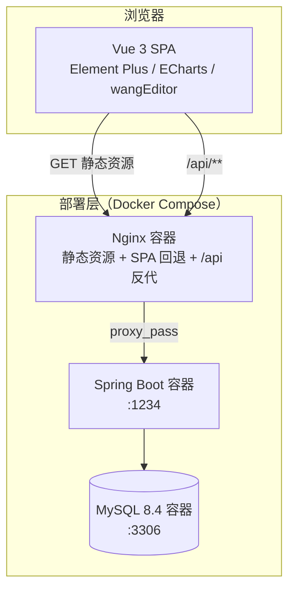

# 架构设计（Architecture）

## 总体架构



## 后端分层

```
org.example.springboot
├── config/        配置层：Web 拦截器、OpenAPI、缓存、AOP 日志、RSA 密钥、安全配置
├── common/        公共层：Result 统一响应、GlobalExceptionHandler 全局异常
├── controller/    控制层：REST 接口，只做参数校验与编排，不写业务
├── service/       业务层：核心业务逻辑（拼团闭环、推荐算法、订单流转等）
├── mapper/        数据层：MyBatis-Plus BaseMapper 接口
├── entity/        实体：与数据库表一一对应
├── enumClass/     枚举：订单状态、角色等
└── util/          工具：RSA 加解密、缓存（CacheUtil）、邮件等
```

**依赖方向**：Controller → Service → Mapper，禁止反向依赖与跨层调用。

## 关键设计决策

### 1. 认证：JWT + 拦截器（而非 Spring Security 过滤器链）

- 场景是前后端分离的单体应用，无 SSO 需求，`JwtInterceptor` 覆盖 `/api/**` + 白名单足够
- 密钥经 `APP_JWT_SECRET` 注入，支持多实例水平扩展（无状态）
- 白名单集中在 `WebConfig`，如 `/api/user/login`、`/api/user/register`、`/api/user/public-key`

### 2. 登录传输加密：RSA 混合方案

```
浏览器                                服务端
  │ GET /api/user/public-key            │
  │───────────────────────────────────►│  返回公钥
  │ password --RSA(PKCS1)--> cipherText │
  │ "RSA:" + Base64(cipherText)         │
  │───────────────────────────────────►│  私钥解密 → BCrypt 校验
```

- 密钥来源优先级：环境变量（生产多实例必须固定）→ 启动自动生成（仅开发，重启失效）
- 服务端拿到明文后仍走 BCrypt 校验，传输加密与存储散列各司其职

### 3. 登录防爆破：进程内缓存

- `CacheUtil.LOGIN_FAIL_CACHE`（ConcurrentHashMap）记录失败次数与首失败时间
- 15 分钟窗口内失败 ≥5 次 → 锁定 15 分钟；成功登录清零
- 锁定状态在密码校验**之前**检查，防止锁定期间继续消耗 BCrypt 算力
- 演进方向：多实例部署时迁移至 Redis（见 Roadmap）

### 4. 可观测性：AOP + MDC traceId

- `ApiLoggingAspect` 环绕所有 Controller 方法
- 每个请求生成 16 位 traceId 写入 MDC，日志格式 `%X{traceId}` 自动携带
- 单请求跨多层日志可凭 traceId 串联；耗时 >2s 自动升级为 WARN

### 5. 统一响应与异常

```json
{ "code": "0", "msg": "成功", "data": { } }
```

- `code="0"` 成功；`"-1"` 业务失败；HTTP 层仅用于 401/403/500 等传输语义
- `GlobalExceptionHandler` 兜底：参数校验（`@Validated`）、JSON 格式错、未知异常全部转统一格式，不向客户端泄露堆栈

### 6. 动态菜单权限

- 菜单存于数据库 `menu` 表，按角色授权
- 登录后前端调用 `setRoutes()` 动态注册路由（vue-router 4 `addRoute`）
- 守卫双重校验：路由级（`beforeEach` 检查 `backUser` + `userMenuList`）+ 接口级（JWT 拦截器）

### 7. 智能推荐：基于用户的协同过滤

- 数据源：订单行为 + 收藏行为构造用户-商品矩阵
- 相似度：余弦相似度，取 Top-N 相似用户的偏好商品，过滤已购
- 每日凌晨定时任务预计算，写入推荐缓存表，前台请求零计算

## 前端架构

```
vue3/src
├── main.js              入口：Element Plus 全量注册 + 图标兼容层
├── router/index.js      路由：静态路由 + 动态后台路由注册 + 双守卫
├── store/index.js       Vuex：全局状态
├── utils/request.js     axios 封装：token 注入、错误去重、401 自动登出
├── components/          业务组件（ProductCard、Pagination、Upload…）
├── views/front/         前台商城页面
└── views/               后台管理页面（按菜单动态挂载）
```

- **图标兼容层**：从 element-ui 2.15.14 官方 CSS 提取 280 个 `el-icon-*` 码点生成
  `element-ui-icon-compat.css`，旧模板中的 `<i class="el-icon-xxx">` 在 Element Plus 下照常渲染
- **多环境**：`.env.development` / `.env.production` 注入 `VITE_API_BASE_URL`，axios baseURL 与全局 HOST 均从环境变量读取
